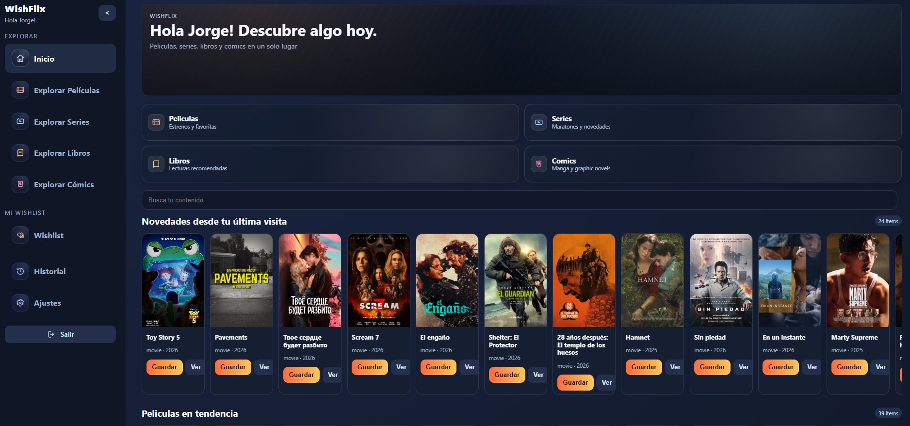
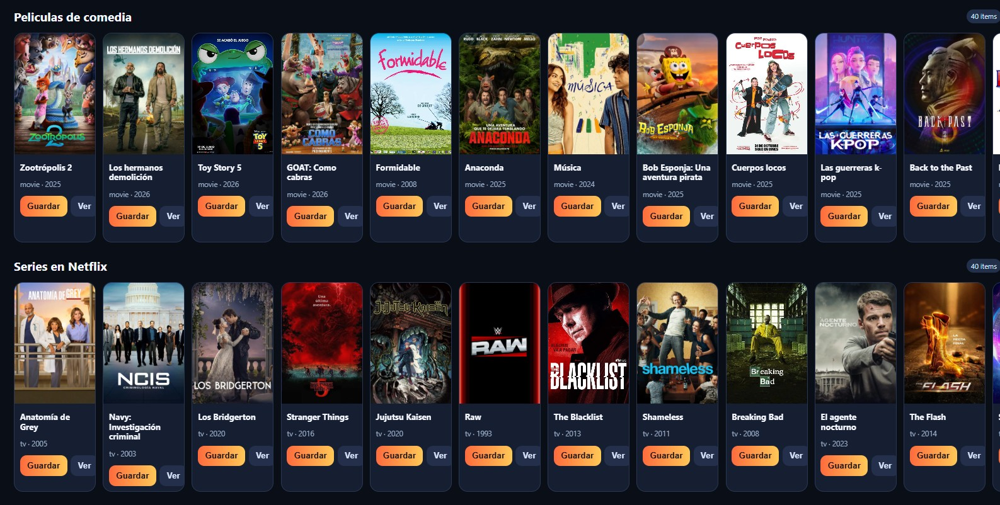
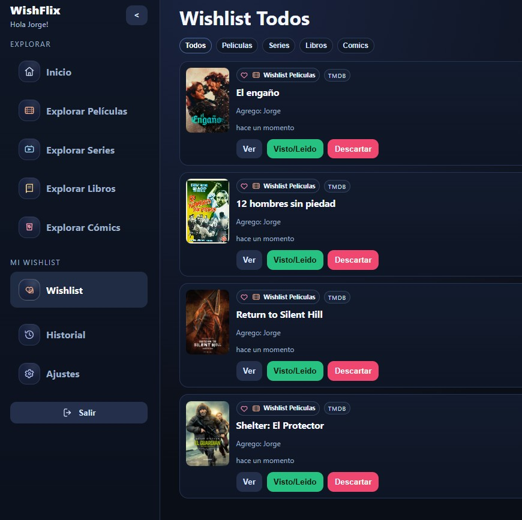
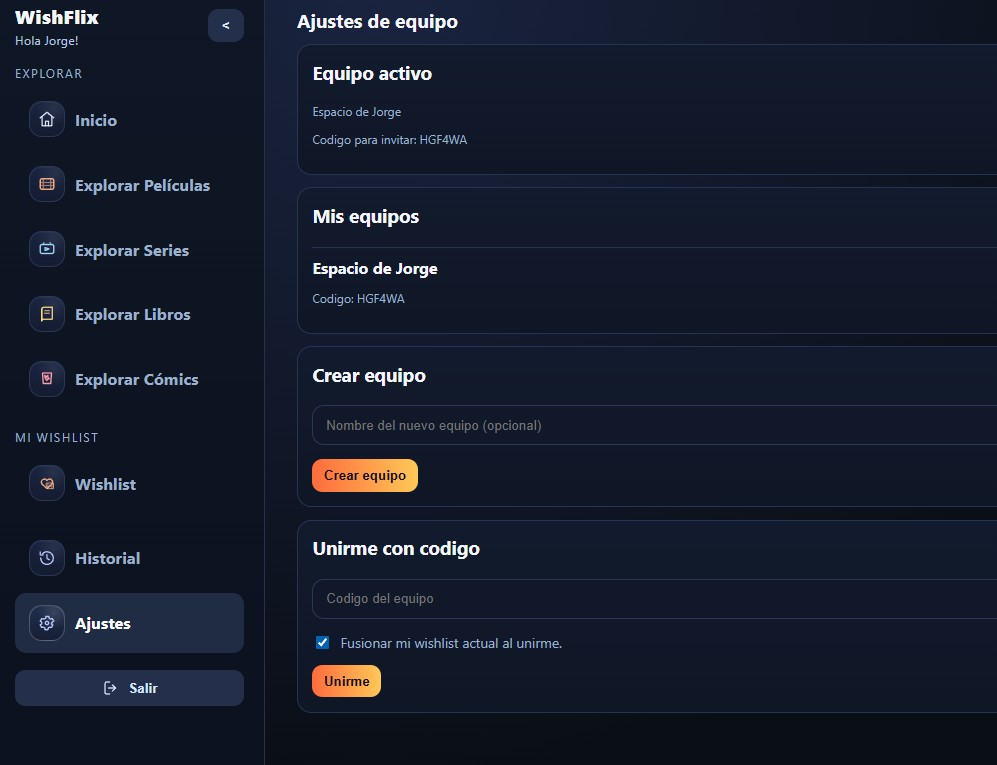
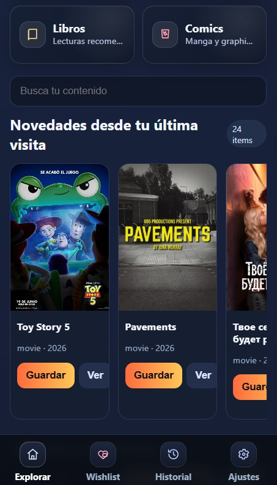

# Wishflix

Wishflix is a self-hosted app to build and manage wishlists of your favorite movies, TV shows, books, and manga/comics.

You can use it as a personal tracker or as a shared family/group wishlist so everyone can save what they want to watch or read later.

The app is designed to help you organize and remember content. It does not download media.  
It enriches content with metadata from:
- TMDB (movies and TV)
- Open Library (books and comics/manga)

This makes it useful as a planning layer before updating your own media services later, such as:
- Plex / Jellyfin (movies and TV series)
- Kavita (books and comics)

## Features

- Create personal wishlists by content type.
- Create or join shared team spaces with a join code.
- Build a family/group wishlist with collaborative contributions.
- Discover currently trending/popular movies and TV content from multiple platforms/providers.
- Browse books/comics and add items quickly.
- Track item state (`wishlist`, `completed`, `discarded`).
- Mobile-friendly responsive UI.
- Ready for self-hosting on your own server.

## Docker

Prebuilt Docker image is available here:

https://hub.docker.com/r/navihdz/wishflix

## Run Locally

### Requirements

- Node.js 20+
- npm

### 1. Clone the repository

```bash
git clone https://github.com/Navihdz/wishflix.git
cd wishflix
```

### 2. Install dependencies

```bash
npm install
```

### 3. Configure environment variables

Create `.env` from the example:

```bash
cp .env.example .env
```

Edit `.env` and set:
- `DATABASE_URL` (default local SQLite value is fine)
- `SESSION_SECRET`
- `TMDB_API_KEY`

Get your TMDB API key from:
https://www.themoviedb.org/settings/api

### 4. Prepare the database

```bash
npx prisma migrate deploy
```

Optional demo data:

```bash
npm run db:seed
```

### 5. Start the app

```bash
npm run dev
```

Open:

http://localhost:3000

## Screenshots

### Home




### Wishlist



### Team / Shared Space Settings



### Mobile Version



## Notes

- Wishflix does not provide downloading features.
- It is focused on metadata-driven discovery and wishlist management.
- Ideal for running on your own server/home lab.
